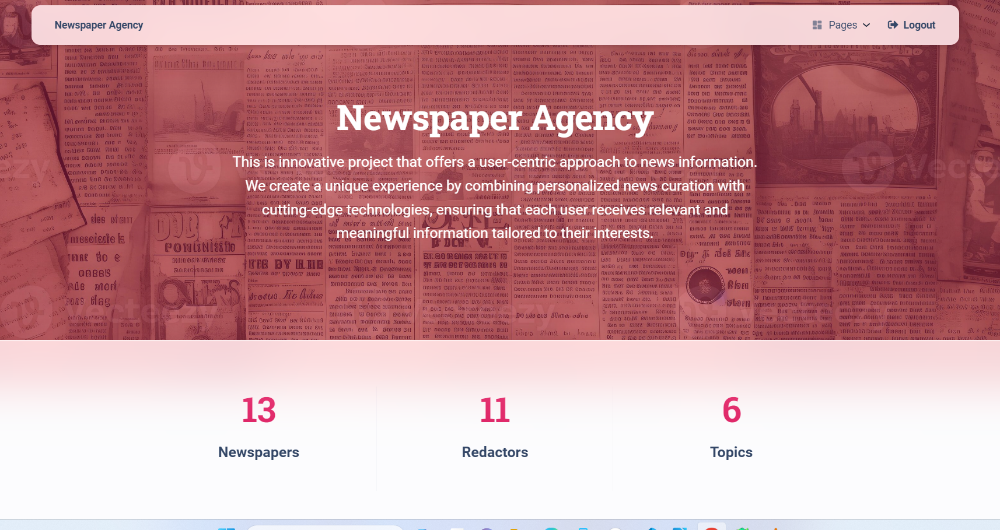

# Newspaper agency (NA) project

Django project for managing newspapers and authors in Agency

## Check it out!

[NA deployed to render] (https://...)

## Installation

Python3 must be already installed

```shell
git clone https://github.com/fedorov-s-od/newspaper-agency/tree/main
cd newspaper-agency
python -m venv venv
python venv\Scripts\activate
pip install -r requirements.txt
python manage.py runserver
```

## Features

* Authentication functionality for Redactor/User
* Managing authors, newspapers and their topics directly from website interface
* Powerful admin panel for advanced managing

## Demo




# newspaper-agency
`python manage.py loaddata db_data.json`

- After loading data from fixture you can use following superuser (or create another one by yourself):
  - Login: `admin.user`
  - Password: `1qazcde3`
